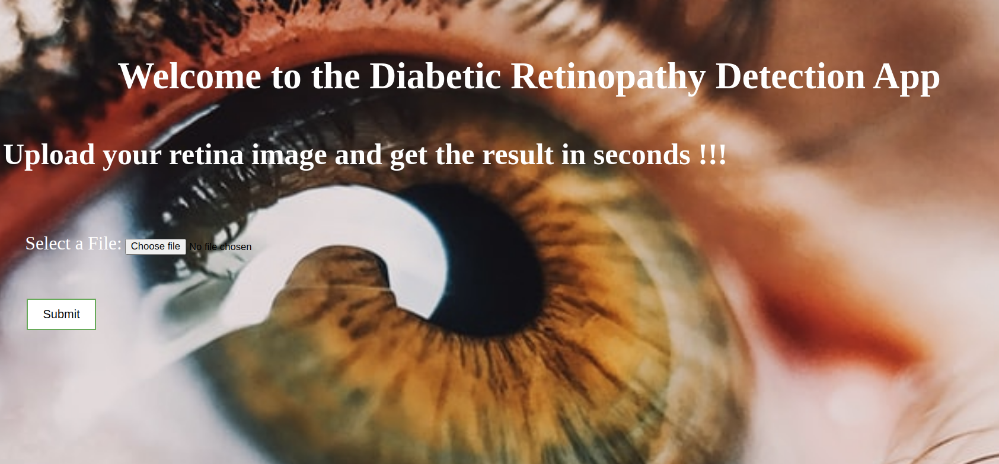
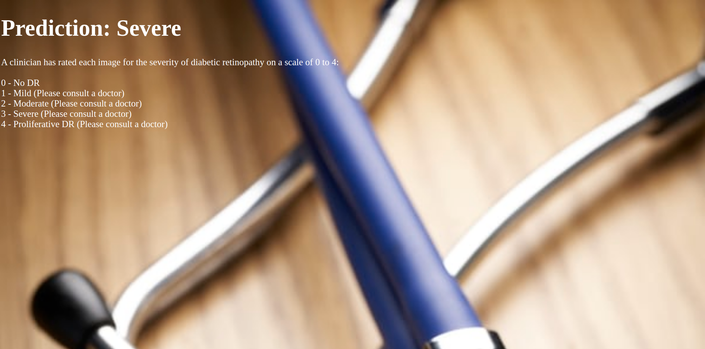

# Diabetic Retinopathy [Webapp](https://dr-prediction-app.herokuapp.com/)
An AI powered website to check whether the person is suffering from diabetic retinopathy or not.

#### Tech Stack: Deep Learning, Django, Python, Basic Frontend technologies (HTML5, CSS)

### Understanding
Diabetic retinopathy is the leading cause of blindness in the working-age population of the developed world. It is estimated to affect over 93 million people. Progression to vision impairment can be slowed or averted if DR is detected in time, however this can be difficult as the disease often shows few symptoms until it is too late to provide effective treatment.

Currently, detecting DR is a time-consuming and manual process that requires a trained clinician to examine and evaluate digital color fundus photographs of the retina. By the time human readers submit their reviews, often a day or two later, the delayed results lead to lost follow up, miscommunication, and delayed treatment.

Clinicians can identify DR by the presence of lesions associated with the vascular abnormalities caused by the disease. While this approach is effective, its resource demands are high. The expertise and equipment required are often lacking in areas where the rate of diabetes in local populations is high and DR detection is most needed. As the number of individuals with diabetes continues to grow, the infrastructure needed to prevent blindness due to DR will become even more insufficient.

This my attempt to accomplish the task.

 
### Requirements
For installing requirements: pip install requirements.txt.

### Future Works
Even though the model might classify well and give good results but still there are a lot of chances to improve :)

### Screenshots of application

#### Home

#### Result

